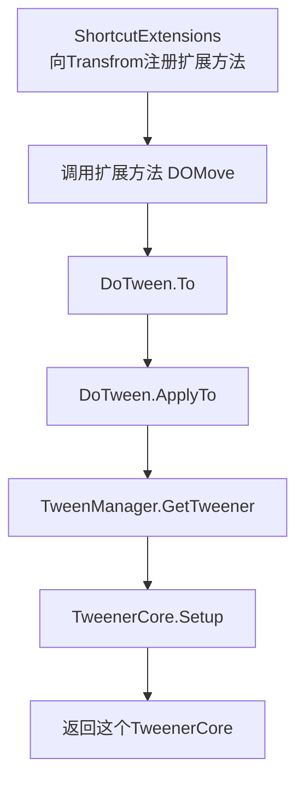
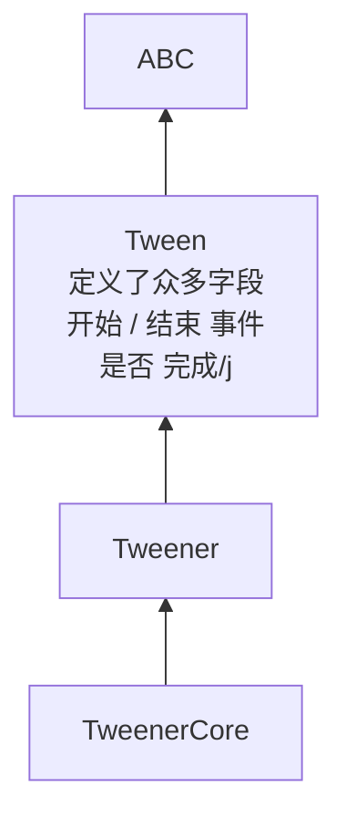

### 流程

#### 调用 Transfrom.DoMove()

```mermaid
graph TB
	extension[ShortcutExtensions<br>向Transfrom注册扩展方法] -->
	doMove[调用扩展方法 DOMove] -->
	to[DoTween.To] -->
	apllyTo[DoTween.ApplyTo] -->
	getTweener[TweenManager.GetTweener] -->
	setup[TweenerCore.Setup] -->
	return[返回这个TweenerCore]
	
	
```

#### TweenerCore 的继承关系

```mermaid
graph BT
	TweenerCore[TweenerCore<br>] -->
	Tweener[Tweener] -->
	Tween[Tween<br>定义了众多字段<br>开始 / 结束 事件<br>是否 完成/j] -->
	ABC
	
```

